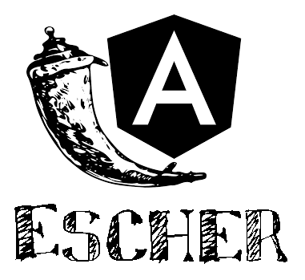

# Escher


## What is the *"Escher"* and what is it for?
**Escher** is a command line tool that lays the foundation for your APP

How to use:

> `python Escher.py <JSON file>`

## What I need?
* JSON file
    - `tables`: Contains the list of tables used in your APP
    - `table`: A table name from your database
    - `field_list`: A list of all field names that are not primary keys
    - `pk_field`: Name of the field that is the table's primary key
    - `nested`: Fields that represent a relationship with other tables (you must list the NAMES of those tables)
    - `db_type`: Supported types are: DynamoDB, MongoDB, Neo4J, Postgres and SqlServer
    - `db_config`: Configuration information specific to your database (such as user, password...) - If in doubt, use the parameter "-\<database name>" on the command line
    ```
        python Escher.py -dynamoDB
    ```

* Requirements: 

    The _requirements.txt_ file has a lot that you may not need to use:
    - boto3 and botocore - are only for DynamoDB
    - neo4J
    - psycopg2 - Postgres only
    - pymongo
    - pyodbc - SqlServer only

## What is produced?

After running Escher with a valid JSON file, a folder with the same name as that file will be created.
Inside, you will find:

* The `model` folder with the definitions of a table and its fields
* The `resource` folder for classes that will respond to requests for multiple records (all*.py files) and for requests with parameters that affect only one record (files *by_id.py)
* The `service` folder with the classes that will take the data from the database to the request classes (/ resource).
* The `tests` folder that will contain the unit tests to check if the services are behaving as expected.


## Swagger Documentation
When running the generated APP, you can access the swagger documentation in the browser at
> `http://localhost:5000/docs`

* You can test the GET, POST, PUT and DELETE requests through this page.
* To change the text related to each endpoint, you have to change the docstring of the corresponding method within \ resource
* In these docstrings you can also change the **tags**, which are like \#Read or \#Write to group the endpoints in any way you want.
* You can also customize how swagger handles your APP details, in the `swagger_details` function of app.py.


## Angular pages
((((under development))))

---

Thank you for testing this tool. I hope it helps you with your projects!


Julio Cascalles
---
